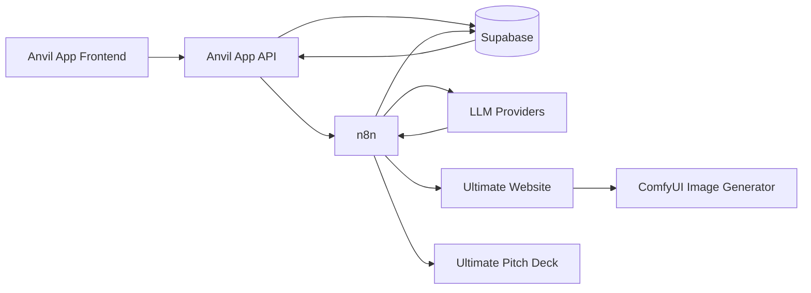

# Anvil of Ideas ⚒️
> Forge Your Future: An AI-Powered Platform for Crafting and Refining Business Ideas.

Anvil of Ideas is a powerful platform designed for founders and entrepreneurs to transform raw concepts into structured, valid business models. By leveraging AI-driven generation and n8n-powered workflows, it automates the creation of critical business documents and technical specifications.

## ✨ Key Features

- **🚀 Idea Forge**: A centralized dashboard to manage and brainstorm business ideas.
- **📋 AI Lean Canvas**: Automatically generate structured lean canvases from simple idea descriptions.
- **📄 Document Generation**: AI-powered creation of:
  - Business Requirements Documents (BRD)
  - Functional Requirements Documents (FRD)
  - Project Requirements Documents (PRD)
- **⚙️ Integrated Workflows**: Seamless integration with **n8n** for backend automation and document synchronization.
- **💾 Supabase Integration**: Robust persistence layer for managing documents and project states.
- **🎨 Modern UI**: A sleek, responsive dashboard built with React and Tailwind CSS.

## 🏗️ Architecture

The system follows a modular architecture connecting the frontend application to powerful automation engines.



## 🛠️ Tech Stack

- **Frontend**: React, TypeScript, Vite, Tailwind CSS, Lucide Icons, Shadcn UI.
- **Backend**: Node.js, Express, tsx.
- **Database/Storage**: Supabase (PostgreSQL), Drizzle ORM.
- **Automation**: n8n Workflows.
- **Documentation**: Markdown, Mermaid.

## 📁 Project Structure

```text
├── client/          # React frontend application
├── server/          # Express API server & Supabase integration
├── shared/          # Shared Zod schemas and types
├── docs/            # Architecture and workflow documentation
├── scripts/         # Utility scripts
├── sql/             # Database migrations and setups
└── public/          # Static assets
```

## 🚀 Getting Started

### Prerequisites

- Node.js (v18+)
- npm or yarn
- A Supabase account and project
- An n8n instance for workflow execution

### Installation

1. **Clone the repository**:
   ```bash
   git clone <repository-url>
   cd anvil-of-ideas
   ```

2. **Install dependencies**:
   ```bash
   npm install
   ```

3. **Configure Environment Variables**:
   Create a `.env` file in the root directory and add the following:
   ```env
   # Database & Supabase
   SUPABASE_URL=your_supabase_url
   SUPABASE_API_KEY=your_supabase_key
   DATABASE_URL=your_db_url

   # n8n Integration
   N8N_AUTH_USERNAME=your_username
   N8N_AUTH_PASSWORD=your_password
   N8N_BRD_WEBHOOK_URL=your_brd_webhook
   N8N_FUNCTIONAL_WEBHOOK_URL=your_frd_webhook
   N8N_WF_VECTOR_WEBHOOK_URL=your_wf_vector_webhook
   ```

4. **Run the Development Server**:
   ```bash
   npm run dev
   ```
   The application will be available at `http://localhost:5000`.

## 📜 License

This project is licensed under the MIT License - see the `package.json` file for details.
